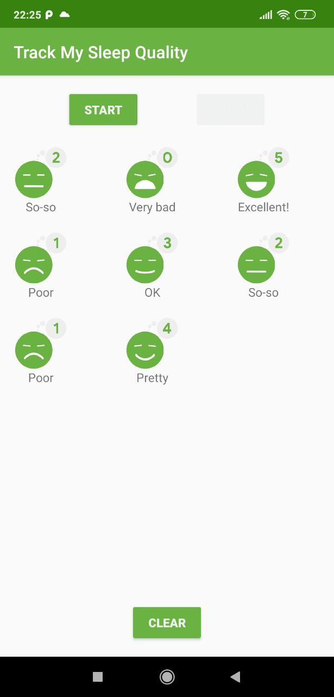
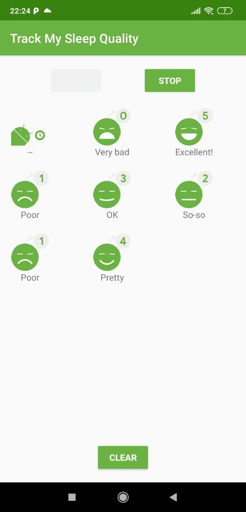
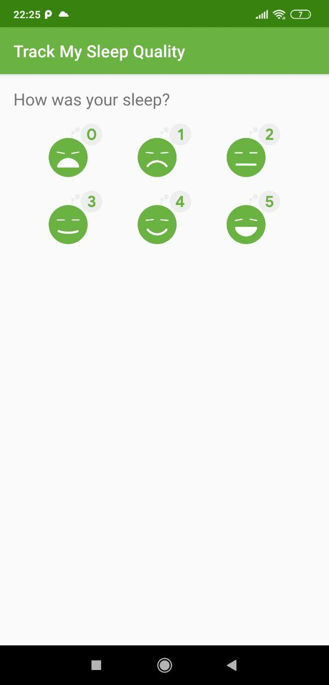

TrackMySleepQuality - Starter Code
==================================

Starter code for Android Kotlin Fundamentals Codelab 6.1 Room

Introduction
------------

TrackMySleepQuality is an app for recording sleep data for each night. 
You can record a start and stop time, assign a quality rating, and clear the database. 

In this codelab, working from this starter app,
you will implement the Room database that holds the sleep data. 
You will then use instrumented tests to verify that this backend works. 

